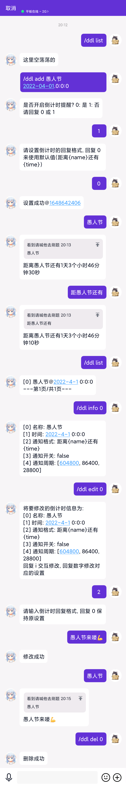

# mirai-plugin-countdown

> 一个用于提醒deadline/倒计时的 [Mirai Console](https://github.com/mamoe/mirai-console) 插件。

## 开始使用

### 安装

插件本体 [Release](https://github.com/YehowahLiu/mirai-plugin-countdown/releases)

[chat-command](https://github.com/project-mirai/chat-command) 用于在聊天环境中执行命令

### 配置文件

配置文件路径为`config/cc.redme.mirai.plugin.countdown/Countdown.yml`, 在第一次启动时会自动生成

也可根据如下配置模板手动创建配置文件

```yaml
# 默认的计时提醒周期, 多个周期间隔为英文逗号, 可以加入单位, 如: 1d, 1h, 1m, 1s
defaultNotifyInterval: 7d,1d,8h
# 守护进程检测周期, 单位为秒, 设为-1来禁用
daemonInterval: 3600
# 列表每页行数
page_len: 10
# 提问句型, 在这些句型出现时会查询是否有相关倒计时并回复
query_pattern: 
  - '(?<=距)\S+(?=还有)'
  - '(?<=什么时候)\S+'
  - \S+
```

### 命令

可行的指令前缀包括: `/ddl`, `/deadline`, `/countdown`, `/倒计时` 
(下方表格以`/ddl`为例)

<...> 展示指令名称，其中空格隔开表示任选其一执行

[...] 展示指令参数，如后有`?`代表此参数可选

| 指令                                     | 描述         |
|----------------------------------------|------------|
| /ddl <add 添加> [name] [date] [contact]? | 添加一个倒计时    |
| /ddl <del 删除> [index] [contact]?       | 删除指定索引的倒计时 |
| /ddl <edit 修改> [index] [contact]?      | 修改指定索引的倒计时 |
| /ddl <info 详情> [index] [contact]?      | 查看指定索引的倒计时 |
| /ddl <list 列表> [page]? [contact]?      | 列出指定页的倒计时  |

**指令参数说明**:
- name: 倒计时名称
- date: 倒计时日期, 可用格式包括：
  - `yyyy-mm-dd.hh:mm:ss`, 如 `2022-03-30.18:00:00`
  - `1年后`, `2个月后`, `3天后`, `4小时后`, `5分钟后`, `6秒后` 等; 需使用阿拉伯数字
- contact: 操作的联系人, 可以是qq号, 群号, 群名, 或者是群成员的昵称
- page: 列表页码, 从1开始
- index: 列表索引, 从0开始

### 权限

上述指令需要 `cc.redme.mirai.plugin.countdown:command.countdown` 权限

特别注意的是, 通过可选参数来指定操作的对象时， 需要`cc.redme.mirai.plugin.countdown:cross-contact`权限

如要允许bot主动通知倒计时进展, 需要添加 `cc.redme.mirai.plugin.countdown:notify` 权限

## 使用效果：

